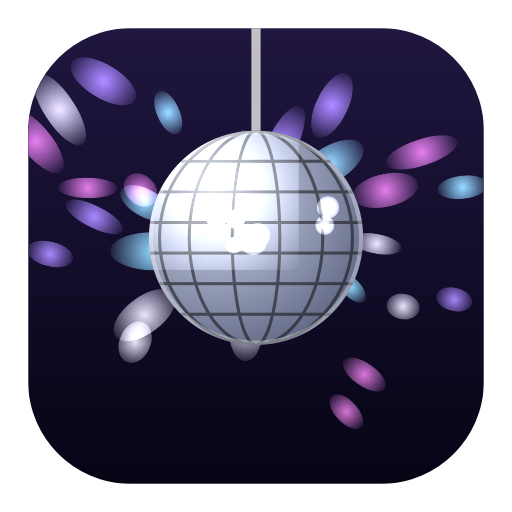

# DiscoBreak

Hover the notch. A disco ball drops over everything on screen, throws light across
your windows, and the music starts. Move away and it retracts.

The notch is dead space — the menu bar wraps around it and nothing lives in the
middle. This puts something there.



## Install

Download the DMG from Releases, drag DiscoBreak to Applications, open it.

It has no Dock icon. Look for the mirror-ball glyph in the menu bar — that's
settings, Test Drop, pause and quit.

Until the app is notarized, macOS will warn on first open. Right-click the app →
Open → Open.

## What it does and does not ask for

No permissions. Nothing to approve on first launch.

- The pointer is polled 20 times a second via `NSEvent.mouseLocation`. No event
  tap, so no Accessibility permission.
- **The screen is never captured.** The light is computed from mirror-ball
  geometry, not read off your display. There is no Screen Recording prompt
  because there is no Screen Recording.
- Spotify mode is the one exception: controlling Spotify triggers macOS's
  standard one-time Automation prompt, and only if you turn that mode on.

## The light

A real mirror ball is roughly 400 flat mirrors in latitude rows. At any instant
the ones facing the lamp *and* aimed at the wall throw a spot — about 105 of
them, as stretched ellipses, all sweeping together as the ball turns.

DiscoBreak runs that as actual reflection math every frame: rotate each tile
normal, cull the ones facing away, reflect the light vector, intersect the
screen plane, and size the ellipse by the angle the beam lands at. The field
moves as one because it is one, and the ball turns at 2.4 RPM like a real motor
rather than the frantic spin most fakes use.

See [`ReflectionSolver.swift`](Sources/DiscoBreak/Rendering/ReflectionSolver.swift).

## Music

**Local file (default).** Ships with an original 120 BPM loop. Drop any audio
file into `~/Library/Application Support/DiscoBreak/` and it plays that instead
— any name, any common format. Settings → Music → Start at skips the intro.

**Spotify playlist.** Paste a playlist link into Settings → Music. It shuffles,
plays, and restores whatever you were listening to when the ball retracts.
Because AppleScript round-trips take 200–600ms, the local track fires instantly
as a stinger and Spotify fades in underneath it — you never hear the gap.

Spotify Premium recommended; nothing here handles ad breaks.

## Settings

Menu bar icon → Settings…, or edit
`~/Library/Application Support/DiscoBreak/settings.json` directly. Partial files
are fine — anything you leave out keeps its default. Sliders apply live.

| Tab | Controls |
|---|---|
| Look | ball size, drop distance, light intensity, spot count, spread |
| Motion | rotation speed, frame rate, drop bounce and speed |
| Music | source, playlist, start offset, volume |
| Behaviour | launch at login, multi-display, hot zone padding, exit delay |

On a Mac without a notch, the hot zone is a 185×32pt strip at the top centre of
the screen instead.

With more than one display attached, the ball hangs on the built-in screen and
the others get the light field. Every display sweeps in lockstep because each
derives its angle from the same clock. Turn it off in Behaviour.

Under Low Power Mode or thermal pressure the frame rate and spot count step
down automatically — see [`EnergyBudget.swift`](Sources/DiscoBreak/EnergyBudget.swift).

## Build

```bash
swift build
./Scripts/bundle.sh            # -> build/DiscoBreak.app
./Scripts/release.sh           # -> build/DiscoBreak-<version>.dmg
```

Swift Package Manager, no `.xcodeproj`. macOS 14+. AppKit and Core Animation
only — no Metal, no shaders, no assets beyond the icon and the loop.

To sign and notarize a real release:

```bash
DEVELOPER_ID="Developer ID Application: Your Name (TEAMID)" \
NOTARY_PROFILE="discobreak" ./Scripts/release.sh
```

## Audio rights

The bundled loop was synthesised from scratch for this project by
[`Scripts/make-loop.swift`](Scripts/make-loop.swift) — kick, hats, clap, bass and
stabs, all generated sample by sample — so it carries no third-party rights.
The app icon comes from [`Scripts/make-icon.swift`](Scripts/make-icon.swift) the
same way. Anything you drop into Application Support stays on your machine and is
never bundled or distributed.
